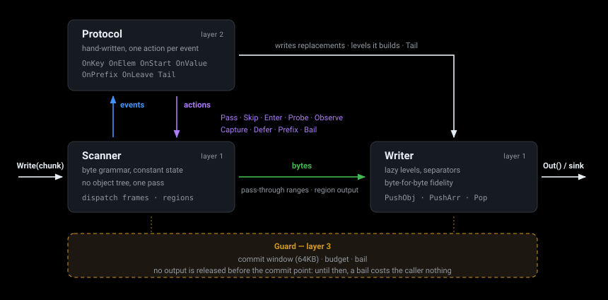

# ason

**Streaming JSON transformation for Go.** ason rewrites a JSON document while it is still arriving: feed it
chunks of any size and take the transformed output as soon as it is ready, without ever loading the whole
document into memory.

- **Streaming.** Memory does not grow with the document. Only the values a protocol explicitly asks to hold are
  buffered, and each has an upper bound.
- **Byte-faithful.** Bytes the transform does not touch come out exactly as they went in — whitespace, key order
  and escapes included. An in-place rewrite is byte-identical to an `sjson` edit.
- **Strict.** Input is validated byte by byte with the same rejection rules as `encoding/json`, checked by fuzzing
  in both directions.
- **Safe to fall back.** No output is released during the first 64KB of input, so a caller can still switch
  strategy when a document turns out to be unsupported.
- **Small footprint.** Standard library only; builds for `GOOS=wasip1 GOARCH=wasm`.

**Contents:** [Install](#install) · [Quick start](#quick-start) · [How it works](#how-it-works) ·
[Configuration](#configuration) · [Errors](#errors) · [Architecture](#architecture) · [Examples](#examples) ·
[Testing](#testing)

## Install

```sh
go get github.com/axfor/ason
```

Requires Go 1.27 or later.

## Quick start

A **protocol** is a set of callbacks. Embed `ason.BaseProtocol`, which passes everything through, and override
only what you need:

```go
package main

import (
	"fmt"
	"os"

	"github.com/axfor/ason"
)

// tidy renames "model" to "engine" and drops "debug"; everything else passes through untouched.
type tidy struct{ ason.BaseProtocol }

func (tidy) OnKey(t *ason.Transformer) ason.Action {
	if t.Depth() == 1 {
		switch t.Last() {
		case "model":
			return ason.Pass().As("engine")
		case "debug":
			return ason.Skip()
		}
	}
	return ason.Pass()
}

func main() {
	t := ason.NewTransformer(tidy{})

	// Chunks may split anywhere -- here, in the middle of a value and of a key.
	for _, chunk := range []string{`{"model":"gp`, `t-4o","debug":{"tr`, `ace":1},"stream":true}`} {
		t.Write([]byte(chunk))
		os.Stdout.Write(t.Out())
	}
	os.Stdout.Write(t.Finish())
	fmt.Println()

	if err := t.Err(); err != nil {
		fmt.Fprintln(os.Stderr, "transform failed:", err)
		os.Exit(1)
	}
}
```

Output:

```json
{"engine":"gpt-4o","stream":true}
```

`model` is renamed, `debug` is dropped, and every other byte is copied through unchanged.

`Out()` returns nothing until 64KB of input has been read (the [commit window](#the-commit-window)), so for a
small document the whole output comes from `Finish()`.

## How it works

![How the engine and a protocol's hooks transform a document as it streams: the document arrives in four chunks, and inside one pass of the ason engine every field reaches the protocol as a hook call — OnKey answers Pass for model, Skip for debug, Capture for owner, whose value comes back through OnValue where the protocol writes "team":42, and Pass for the 512KB text value. The engine moves the bytes itself according to those answers. Numbered marks show how much output exists once each chunk has been read — chunk 2 carried only the skipped field, so the output did not grow — and the held line stays at zero except for the nine bytes of the captured value, "team/42", which the engine holds only until OnValue takes it.](docs/streaming.svg)

For every key or array element in a container the protocol has *entered*, the engine calls the protocol and
asks for an **action**. The protocol only decides; the engine moves the bytes. Values the protocol does not ask
to see stream straight through.

### Actions

| Action | What happens to the value | Held in memory |
|---|---|---|
| `Pass()` | Forwarded unchanged | Nothing |
| `Skip()` | Dropped | Nothing |
| `Enter()` | Descend into the object or array; its children are dispatched too | Nothing |
| `Probe()` | Look at the value's type first, then decide in `OnStart` | Nothing |
| `Observe(cap)` | Forwarded, and a copy is handed to `OnValue` | Up to `cap` |
| `Capture(cap)` | Handed to `OnValue`; the protocol writes the replacement | Up to `cap` |
| `Defer(cap)` | Held, then dispatched again when the protocol calls `Release` | Up to `cap` |
| `Prefix(cap)` | A string's first `cap` bytes go to `OnPrefix`, which decides how the rest streams | Up to `cap` |
| `Bail(reason)` | Stop: this document is not supported | — |

`BailCode(code, reason)` is `Bail` with an error [code](#errors).

### Modifiers

| Modifier | Applies to | Effect |
|---|---|---|
| `.As(name)` | `Pass`, `Enter` | Rename the key |
| `.Wrap(prefix, suffix)` | `Pass` | Write bytes around the value |
| `.Inner()` | `Pass` | Write a string's content without its quotes |
| `.At(level)` | `Pass`, `Enter` | Write to an outer output level |
| `.Lazy()` | `Enter` | Leave the container out entirely if nothing is written into it |
| `.Flat()` | `Enter` | Give the container no output level of its own |
| `.Lenient()` | `Enter` | Treat a value that is not a container as `Pass` instead of bailing |
| `.Via(hook)` | `Enter` | Hand every callback inside the subtree to another `Protocol` |

### Callbacks

| Callback | Called when |
|---|---|
| `OnKey(t)` | A key has been read. `t.Last()` is its name and `t.Depth()` its depth |
| `OnElem(t)` | An array element starts |
| `OnStart(t, kind)` | After `Probe`, once the value's type is known |
| `OnValue(t, raw)` | A `Capture` or `Observe` value is complete |
| `OnPrefix(t, raw, complete)` | A `Prefix` window is full, or the string ended inside it. Returns the next action and where the rest resumes |
| `OnLeave(t)` | An entered container closes |
| `Tail(t)` | The root has closed; add trailing fields here |

Inside a callback, `t.W()` is the output writer: `Key`, `Raw`, `JSONString` and `Int` write output, `PushObj` /
`PushArr` / `Pop` build output levels the input does not have, and `AppendWith` lets an encoder write straight
into the output buffer. `raw` is only valid during the callback.

### Driving a transformer

| Call | Purpose |
|---|---|
| `NewTransformer(p)` | Create a transformer for one document |
| `Write(chunk)` | Feed the next chunk; chunks may split anywhere |
| `Out()` | Take the output that is ready — nothing before the commit point |
| `Finish()` | End of input: returns the rest of the output |
| `Err()` | Why the transformer stopped, or `nil` |

## Configuration

Set these before the first `Write`.

| Option | Default | Effect |
|---|---|---|
| `SetCommitBytes(n)` | 64KB | Size of the commit window |
| `SetBudget(n)` | Unlimited | Cap on everything held for one document; `Buffered()` reports the current total |
| `SetRoot(k)` | `RootObject` | Allowed root: `RootObject`, `RootArray` or `RootAny`. Array roots dispatch by index |
| `SetDupKeys(d)` | `DupKeysPass` | Duplicate keys: dispatch each (`DupKeysPass`), bail (`DupKeysBail`), or keep only the first (`DupKeysFirst`, as gjson does) |
| `SetValidateUTF8(on)` | Off | Reject invalid UTF-8 in strings and keys (RFC 3629), including sequences split across chunks |
| `SetFieldTree(tree)` | Off | Reject values whose type the target struct cannot hold — see [type checking](#type-checking-against-the-target-struct) |
| `SetKeyCache(c)` | One per transformer | Share the key cache between transformers that run in turn |

### Output

| Mode | How | Use when |
|---|---|---|
| Pull | Call `Out()` after each `Write` | The simplest case; the returned slice is yours |
| Push | `SetSink(func(b []byte))` | Output is consumed immediately, e.g. written to a connection. `b` is only valid inside the call, and `Out()` returns nothing |
| Pooled | `SetBufferPool(get, put)` | Many streams take turns on one thread and share a few buffers |
| Caller-owned | `SetOutBuffer(buf)` | Strictly sequential streams reuse one buffer. Never share it between transformers that run concurrently |

## Errors

When a transformer stops, `Err()` returns an `*ason.Error`:

| Field | Meaning |
|---|---|
| `Code` | What kind of failure — see below |
| `Msg` | English message; a protocol's own `Bail` text is kept as is |
| `Offset` | The input byte at which it was detected |
| `Path` | Where in the document, e.g. `messages[2].content` |

`Err().Error()` reads like `unexpected comma at byte 512 in messages[2].content`, and `Unsupported()` returns the
same information as a `(bool, string)` pair. Classify failures by `Code`, never by message text. Offsets and paths do not depend on how the input was chunked, with one exception: the
budget check on output held before the commit point runs at the end of each `Write`.

| Code | Meaning |
|---|---|
| `ErrSyntax` | Not valid JSON: structure, literals, numbers, escapes, control characters, or UTF-8 when validation is on |
| `ErrIncomplete` | The input ended before the root closed |
| `ErrRoot` | The root is not a shape `SetRoot` allows |
| `ErrTrailing` | Something other than whitespace follows the root |
| `ErrDuplicateKey` | A duplicate key under `DupKeysBail` |
| `ErrLimit` | A `cap` or the budget was exceeded |
| `ErrLeftoverDefer` | Deferred items were neither released nor dropped before their container closed |
| `ErrUnsupported` | The protocol cannot handle this document: its own `Bail`, or an action that met the wrong value type |
| `ErrMisuse` | The protocol used the API incorrectly, e.g. a nested `Probe` or `Defer` on an array element |

## Architecture



One pass, three layers, no object tree:

- The **scanner** reads the bytes and turns them into events.
- The **protocol** — your code — answers each event with an action.
- The **writer** builds the output. Bytes never pass through the protocol: they go straight from the scanner to
  the writer, and the protocol writes only what it replaces or adds.

Around all three, the **guard** — commit window, budget and bail — decides how long a decision can still be
taken back.

### Dispatch frames and regions

The engine works in two modes, and the rest of the design follows from that split:

- A **dispatch frame** is a container the protocol has entered. Every key and element inside it becomes a
  callback.
- A **region** is a value whose action is already decided, from its first byte to its last. Nothing inside it
  is dispatched: the scanner only checks the grammar and sends the bytes to one destination.

| Region | Opened by | Where the bytes go |
|---|---|---|
| out | `Pass` | To the writer, as a range of the input chunk — not copied while the run is contiguous |
| skip | `Skip` | Nowhere |
| capture | `Capture` | A bounded buffer, then `OnValue` |
| observe | `Observe` | The writer, plus a bounded buffer for `OnValue` |
| defer | `Defer` | A bounded hold, dispatched again on `Release` |
| prefix | `Prefix` | A window for `OnPrefix`, whose answer decides where the rest goes |
| validate | `Pass` or `Skip` on a root-level container the field tree describes | Same as `Pass` or `Skip`, plus a bounded copy that is type-checked when the value ends |

Inside a region no path is tracked and no key is interned; nesting is only a counter and a bit-stack of
container kinds. A subtree the protocol never asked about costs a range copy and no allocation. This is why
memory does not grow with the document: frames exist only where the protocol asked for them.

### Constant state, whatever the chunking

The scanner's whole state is three small, fixed-size machines:

- **Byte state** — idle, in a key, in a string, or in a scalar, plus escape tracking.
- **Frame phase** — key → colon → value → comma, one per dispatch frame.
- **Region phase** — nine phases that also encode the enclosing container kind, so a comma, colon, string or
  scalar is a single table lookup.

None of this depends on where a chunk ends. The same document fed 1, 3, 7, 64 or 4096 bytes at a time produces
the same output, the same errors and the same offsets, and the tests check exactly that.

Keys are interned in a fixed 256-slot cache, so repeated keys do not allocate and a flood of distinct keys
cannot grow it. `SetKeyCache` shares one cache across transformers that run in turn (one goroutine at a time),
so once the first document has been read, dispatching a key allocates nothing.

### The lazy writer

- Entering a container registers an output **level** but writes nothing.
- The first write inside opens the level, along with any unopened ancestors, and handles the separators.
  Protocol code never tracks commas.
- A level that was never written to becomes `{}` or `[]` when it closes, or nothing at all under `Lazy`.
- `Flat` gives an input container no level of its own, and `PushObj` / `PushArr` / `Pop` build levels the input
  does not have. Together they move one input container into a nested output shape.
- `At(level)` writes to an outer level. That works only while every level above it is still unopened;
  otherwise it fails with `ErrMisuse` instead of misplacing the field.

### Byte fidelity

Whitespace is kept, not skipped: before the root, around each key and colon, before array elements, between a
value and its comma, before closing brackets, and after the root. A `Pass` region is a plain byte range.
Together these keep untouched bytes untouched, which the tests check byte for byte against `sjson` in-place
rewrites.

### Zero-copy output

While a chunk is one unbroken pass-through run, the writer copies nothing and `Out()` returns a slice of your
own input chunk. The first byte that is not a straight pass-through switches the writer to a real buffer, and
`Out()` then hands that buffer over instead of copying it, so it is not held for the life of the stream. With a
sink, a run of pass-through bytes after the commit point that is long enough to be worth it goes to the sink as
a view of the input rather than a copy.

### What is held, and what bounds it

| What | Bound |
|---|---|
| `Pass`, `Skip`, `Enter` | Nothing is held |
| `Capture`, `Observe`, `Defer`, `Prefix` | Their own `cap` |
| A container being type-checked | 64KB; a larger value is accepted without being checked |
| Output before the commit point | The commit window |

`Buffered()` reports the total and `SetBudget` caps it. Exceeding a cap or the budget fails with `ErrLimit`, and
the offset points at the first byte that did not fit.

### Deferred fields and replay

`Defer` holds a key and its raw value. `Release` does not replay on the spot: the replay happens at the frame's
next safe point — the end of the current value, or the close of the frame — and never in the middle of a child
frame. Each held item then goes through `OnKey` again, so it gets the action the protocol would choose *now*,
with everything it has learned since.

Items still held when their container closes fail with `ErrLeftoverDefer`: dropping them silently would change
what the document means.

### Sub-hooks

`Enter().Via(hook)` hands every callback inside a subtree to another `Protocol`, including the levels that hook
enters itself and its own `Defer` replays. The container's `OnLeave` still goes to whoever issued the `Enter`,
so it can `Pop` what it pushed. Paths and depths stay absolute, so a reusable part needs no forwarding code in
each callback.

### Suspending the scan

A protocol sometimes needs something the document does not contain, such as an image it has to fetch and
inline:

1. Call `t.Suspend()` from a callback during `Write`. The scan stops at the next byte boundary, the rest of the
   chunk is kept, and `Write` returns with `Suspended()` true.
2. While suspended, the protocol owns the output. It can write from outside any callback — in slices if the
   value is large — and `Flush()` hands each slice to the sink as it goes. `Compact()` gives back memory the
   transformer does not need while it waits.
3. `Resume()` scans the kept bytes and carries on. It may suspend again.

Calling `Write` or `Finish` while suspended, or `Suspend` during a `Defer` replay or in `Finish` (including
`Tail`), fails with `ErrMisuse`.

### The commit window

No output is released until `CommitBytes` (64KB) of input has been scanned. Within that window a `Bail` costs
nothing: the caller still has every raw byte and can fall back, for example to buffering the whole document. A
caller that knows it will not need that fallback can release output early with `CommitNow()`.

After the commit point, released bytes cannot be taken back, so a late bail means failure. A pass-through
protocol can instead stop feeding the transformer and forward the rest of the input verbatim, but only when
both of these hold:

- `Aligned()` is true: every byte read so far has been written out or dropped, and nothing is held for a
  decision still to come.
- `RootDone()` is false: the root's closing bracket is written only by `Finish`.

### Where error offsets point

| Error | Offset |
|---|---|
| Grammar error | The failing byte |
| Cap or budget overflow | The first byte that did not fit |
| A protocol's own `Bail` | The current scan position |
| Raised in `Finish` | The end of the input |

During a `Defer` replay, offsets still point into the original input, not into the held copy.

### Type checking against the target struct

A streaming transform often replaces code that unmarshalled the document into a struct, and that unmarshal
rejected documents whose fields had the wrong type. To reject the same documents while streaming, derive the
expected types from that struct:

```go
t.SetFieldTree(ason.FieldTreeOf(ChatRequest{}, 4)) // 4 is the recursion depth
```

- **Derived, not written.** `FieldTreeOf` reads the struct by reflection (`FieldTypesOf` covers root fields
  only, via `SetFieldTypes`). A hand-kept table drifts from the struct the moment a field is added.
- **Errs toward accepting.** Types with their own `UnmarshalJSON` or `UnmarshalText`, interfaces, and names two
  fields share accept anything, and `null` is always accepted. `encoding/json`'s case-insensitive name matching
  and its rejection of a fraction for an integer field are not reproduced. Every gap makes the check more
  permissive than the unmarshal, never stricter.
- **Bounded.** Nested checks cover only containers the tree describes, up to 64KB each; a larger value is
  accepted unchecked, and containers the tree says nothing about keep the fast path.
- **Dropped fields count too**, because the original unmarshal would have read them.
- A mismatch fails with `ErrUnsupported`, so before the commit point the caller can still fall back.

The tree also records each field's marshal side (`Kind`, `Omit`, `Int`, `ZeroJSON`) for protocols that
reproduce an unmarshal-and-marshal round trip; the engine itself does not use it.

### String scanning

- String bodies are scanned 8 bytes at a time, switching to 16 once a string passes 128 bytes.
- By default the long-string loop is assembly: NEON on arm64 and SSE2 on amd64, with AVX2 chosen at run time
  when the CPU and OS support it.
- With `GOEXPERIMENT=simd` the same scan comes from `simd/archsimd` instead, on arm64, amd64 and wasm.
- The `purego` build tag, and wasm builds without the experiment, use the portable word-at-a-time scan.

### Invariants

1. **Untouched bytes stay untouched.** Pass-through is byte-identical — whitespace, key order and escapes
   included — so an in-place rewrite matches `sjson` exactly.
2. **No assumptions about field order.** A shape that depends on a later field is held with a bounded `Defer`
   and replayed once the information arrives; past the bound it is unsupported, never guessed.
3. **An unsupported document has a way out.** Output is withheld until the commit point, so the caller can still
   take another route cleanly.

## Examples

Each directory under `examples/` is a runnable program that reads JSON from stdin in small chunks and writes the
transformed result to stdout:

| Example | Shows |
|---|---|
| [`passthrough`](examples/passthrough) | `BaseProtocol`: untouched bytes stay identical |
| [`rename`](examples/rename) | `Pass().As`: rename top-level keys |
| [`rewrite`](examples/rewrite) | `KeyProbe`: rewrite top-level values in place, byte-identical to `sjson` |
| [`redact`](examples/redact) | `Prefix`: read only the first bytes of a string and skip the rest |
| [`restructure`](examples/restructure) | `PushObj` / `PushArr` / `Enter().Flat()`: move one container into a nested shape |
| [`defer-replay`](examples/defer-replay) | `Defer` / `Release`: a value arrives before the field that decides its shape |
| [`subhook`](examples/subhook) | `Enter().Via`: hand a whole subtree to another protocol |
| [`attachment`](examples/attachment) | `Prefix` + `Pass().Wrap`: split a `data:` URL and stream its payload into another shape |
| [`observe`](examples/observe) | Read-only: skip everything, count elements, discard the output |
| [`fallback`](examples/fallback) | The commit point: switch strategy when the protocol bails within the first 64KB |
| [`chatconv`](examples/chatconv) | A complete chat-request conversion protocol, checked against a buffered reference |
| [`llm`](examples/llm) | The protocols Higress ai-proxy runs on this engine, with their behavioural tests |

```sh
echo '{"items":[{"k":"v"}],"owner":"team/42"}' | go run ./examples/rewrite -chunk 3
```

`-chunk` sets the chunk size, which is deliberately small by default. The same techniques are verified as
`Example` functions in [`doc_example_test.go`](doc_example_test.go).

## Testing

```sh
go test ./...
```

- **Engine** (`./engine`): actions and replay rules; byte fidelity against `sjson` rewrites; strict rejection at
  every chunk size; identical results at any chunk size on random documents; garbage input never panics; deep
  nesting and multi-megabyte strings.
- **Examples**: every program under `examples/` runs on fixed input at chunk sizes 1, 3 and 4096 and is compared
  with its golden output.
- **Scenarios** (`examples/chatconv/conv`): a protocol that exercises every engine path, checked against a
  buffered reference on 37 hand-written shapes and 3000 random documents at chunk sizes 1, 3, 7, 64 and 4096.
- **Protocol suite** (`examples/llm`): 7 suites of hand-written cases plus 1000 random requests each, compared
  field by field with the buffered implementations at chunk sizes 1, 7, 64 and 4096.
- **Fuzzing** (`./engine`): `FuzzPassthrough`, `FuzzKeyProbe` and `FuzzStrictModes`.

```sh
go test -run='^$' -fuzz=FuzzPassthrough ./engine
```

CI runs on every push and pull request:

- Race-enabled tests on Go 1.27 and the latest stable release, with `gofmt`, `go vet` and a run of every example.
- The vector string scan on arm64, amd64 and wasm (executed under Node), with and without `GOEXPERIMENT=simd`.
- A `wasip1` build, and a check that every architecture builds and selects the right scan.
- Every benchmark compiles and runs once.

## Further reading

- [docs/DESIGN.md](docs/DESIGN.md) — design notes
- [docs/OPTIMIZATION.md](docs/OPTIMIZATION.md) — roadmap and the reasoning behind it
